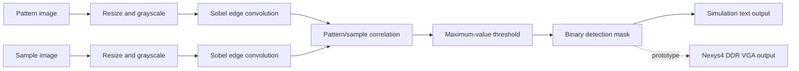

# FPGA CNN Pattern Detector

An end-to-end academic prototype for locating a small visual pattern inside a larger image. The project pairs a MATLAB reference model with a Verilog implementation for the Xilinx Artix-7 device on a Nexys4 DDR board.

## Overview

The detector is described as a convolutional neural network (CNN) in the original report, but it is more precisely a fixed convolutional vision pipeline—there is no training stage or learned model.



The supplied dataset becomes:

| Stage                   |       Stored values |
| ----------------------- | ------------------: |
| Quantized pattern image |                 210 |
| Quantized sample image  |              37,400 |
| Convolved pattern       |                 156 |
| Convolved sample        |              36,624 |
| Final detection map     | 32,342 (206 × 157) |

The MATLAB reference flags values above 85% of the maximum response. The Verilog implementation approximates an 80% threshold with shifts and additions.

## Repository layout

```text
.
├── constraints/        # Nexys4 DDR pin and timing constraints
├── data/
│   ├── images/         # Pattern and sample photographs
│   └── memory/         # Pre-generated Verilog memory files
├── docs/               # Final IEEE-format project report
├── matlab/             # Reference image-processing pipeline
├── rtl/
│   ├── core/           # Convolution, dot-product, clock, and VGA helpers
│   └── top/            # Separate simulation and VGA top modules
├── scripts/            # Simulation runner and output reconstruction
├── tb/                 # Verilog testbenches
└── vivado/             # Reproducible Vivado project script
```

`rtl/top/top_sim.v` and `rtl/top/top_vga.v` both declare a module named `top`. Compile exactly one of them for a given build.

## Run the MATLAB reference

Requirements:

- MATLAB
- Image Processing Toolbox (`imread`, `imresize`, `rgb2gray`, `padarray`, and `imshow`)

From MATLAB:

```matlab
cd matlab
testobj_v2_forClass
```

The script resolves image and memory paths relative to the repository, displays each processing stage, and refreshes `data/memory/pattern_hex.txt` and `data/memory/sample_hex.txt`.

## Run the Verilog simulation

The convenience runner expects [Icarus Verilog](https://steveicarus.github.io/iverilog/) plus Python 3:

```powershell
powershell -ExecutionPolicy Bypass -File .\scripts\run-simulation.ps1
```

It compiles the simulation top, runs the detector, and reconstructs the final binary mask at `build/sim/detections.png`. The reconstruction tool uses only Python's standard library. To process an existing simulator trace directly:

```powershell
python .\scripts\show_image.py path\to\test.txt detections.png
```

The original work used Xilinx ISE 14.7 for simulation. Icarus support is provided as a portable entry point but was not part of the 2018 tool flow.

## Recreate the Vivado project

The hardware variant targets `xc7a100tcsg324-3` (Artix-7 / Nexys4 DDR) and retains the original 40 ns clock constraint:

```powershell
vivado -mode batch -source .\vivado\create_project.tcl
```

Vivado creates a disposable project under `build/vivado`. The original project used Vivado 2018.1; newer versions may upgrade the design metadata.

## Design notes

- A five-state controller sequences pattern convolution, sample convolution, correlation, thresholding, and output.
- `pattern_hex.txt` and `sample_hex.txt` initialize the on-chip image memories.
- The simulation top streams one detection bit at a time for reconstruction by `scripts/show_image.py`.
- The VGA top contains the original display experiment. Its incomplete board output is intentionally documented rather than presented as production-ready.
- Generated Vivado/ISE projects, caches, reports, and archived ZIP files were left out; all hand-written sources and the final report are retained.

## Project history and attribution

This project was completed by **Saad Rahman** at the **University of Maryland, Baltimore County (UMBC)** in 2018. `ConvLayer.m` and `MaxPoolLayer.m` retain their original attribution to Tahmid Abtahi.

See the [final project report](docs/final-report.pdf) for the original architecture, simulation results, timing discussion, and VGA limitation.

## License

No open-source license was included with the original project materials.
